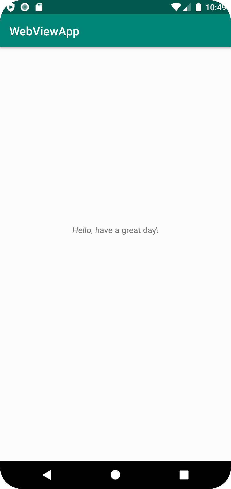

# Rapport

**Skriv din rapport här!**


Jag navigerade till res-layout-content_main. Där ändrade jag textents orientering och vilken text som skrivs.

```
textview
android:rotationX="21"
android:text="Hello, have a great day"
```

